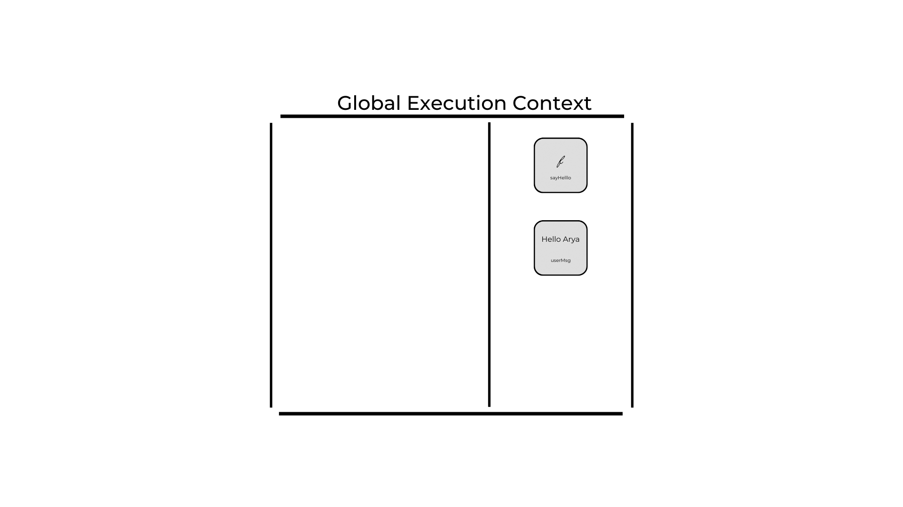

1. What does thread of execution means in JavaScript?
- Its another word used by developers for intrepretion.
2. Where the JavaScript code gets executed?
GEC
3. What does context means in Global Execution Context?
ITS A BOUNDARY WHICH HAS RULES ASSOCIATED WITH SHARING ITS RESOURCE
4. When do you create a global execution context.
Once JS sees its document
5. Execution context consists of what all things?
memory and execution area
6. What are the different types of execution context?
Global and Local/Funtion
7. When global and function execution context gets created?
Global - once in a doc
Local - When any expression is encountered.
8. Function execution gets created during function execution or while declaring a function.
execution

9. Create a execution context diagram of the following code on your notebook. Take a screenshot/photo and store it in the folder named `img`. Use `` to display it here.


```js
var user = "Arya";

function sayHello(){
  return `Hello ${user}`;
}

var userMsg = sayHello(user);
```

<!-- Put your image here -->




```js
var marks = 400;
var total = 500;

function getPercentage(amount, totalAmount){
  return (amount * 100) / totalAmount;
}

var percentageMarks = getPercentage(marks, total);
var percentageProfit = getPercentage(400, 200);
```

<!-- Put your image here -->


```js
var age = 21;

function customeMessage(userAge){
  if(userAge > 18){
    return `You are an adult`;
  }else {
    return `You are a kid`;
  }
}

var whoAmI = customeMessage(age);
var whoAmIAgain = customeMessage(12);
```

<!-- Put your image here -->

